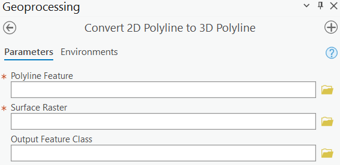

# arcpy-convert-2d-polyline-to-3d-polyline

* Custom tool / script for a ArcGIS Pro to convert 2d polylines to 3d polylines based on values on a surface raster
* Input polyline feature must have only one record.

